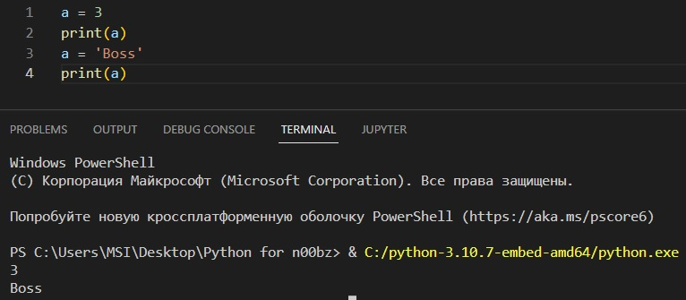
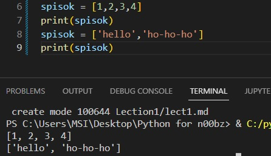
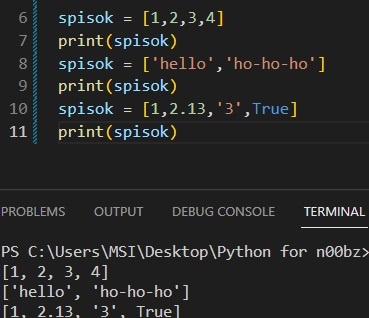
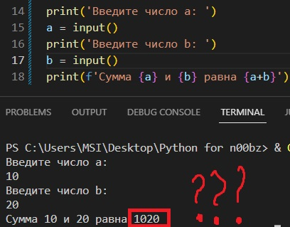

# Знакомство с Python

Язык Python - один из самых распостранённых языков программирования.

## Почему Python?

* <u> *Высокоуровневость*.</u>
* <u> *Простой синтаксис*.</u>
* <u> *Низкий порог вхождения*.</u>
* <u> *Востребованность а рынке*.</u>
* <u> *Кросс-платформенность*.</u>
* <u> *Интерпретируемый*.</u> 

## Синтаксис

### Переменные

Есть 4 остновных типа данных:

1. int - целочисленный
2. float - числа с плавающей точкой
3. boolean - логический
4. string - строковый 
5. list - списки (о них позже)

> Python - это язык с динамической типизацией данных. то есть при объявлении переменных необязательно явно указывать тип переменных.

Это значит, что можно делать так:

#### Пару слов об интерполяции.

Недавно в Python была добавления *интерполяция*. Синтаксис у неё такой:

<code>
a=12

b=1.25

c='Nya'

print('{}-{}-{}'.format(a,b,c))
</code>

или

<code>
a=21

b=25.135

c='UwU'

print(f'{a}-{b}-{c}')
</code>

### Массивы

>В Python нет как таковых массивов, есть списки. Принцип работы с ними в целом схож с принципом работы с массивами.

Задаются они следюущим образом:

Так как Python - это язык с динамической типизацией данных, один и тот же список может содержать данные различного типа: 

НО! Злоупотреблять этим не стоит и нужно стараться придерживаться одного типа в рамках одного списка.  

### Ввод и вывод данных

Для ввода и вывода данных в Python используются

<code>print()</code> или <code>input()</code>

Демонстрация:

Почему так вышло?

> Дело в том, что по умолчанию
